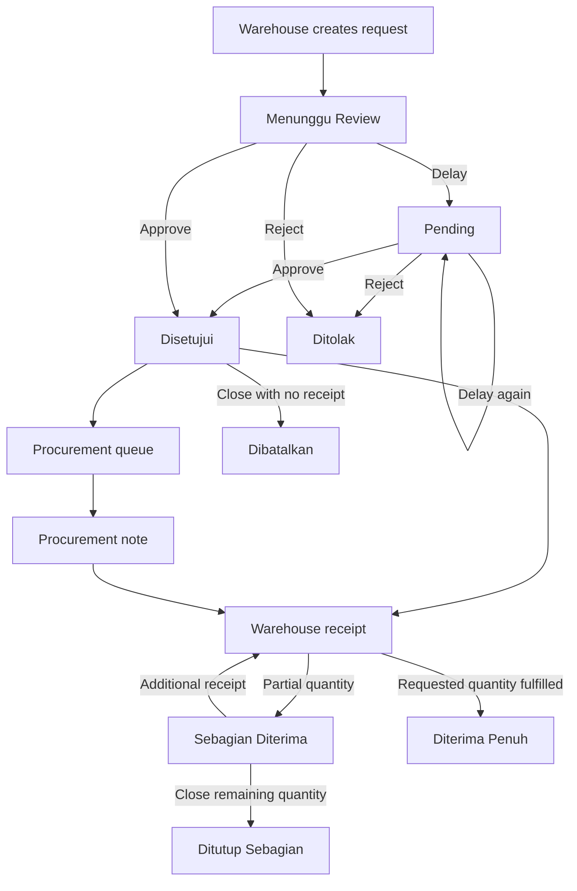
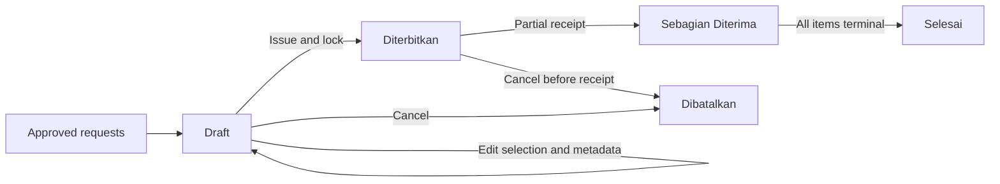
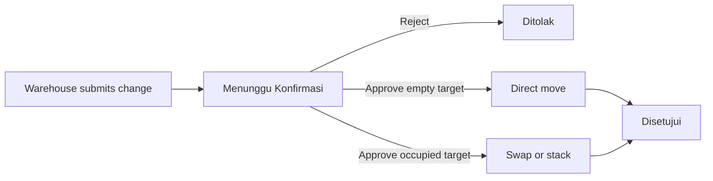

# MVPWarehouse

> An internal, role-based inventory and warehouse resource management system for controlled requests, procurement, stock movement, location management, and executive monitoring.

[](https://laravel.com/)
[](https://www.php.net/)
[](https://tailwindcss.com/)
[](https://vite.dev/)
[](#local-installation)

## Overview

MVPWarehouse digitizes the operational flow between warehouse staff, HR, directors, and administrators. It replaces disconnected paper forms and manual status follow-up with a centralized workflow that records requests, approvals, procurement notes, partial receipts, stock balances, location changes, notifications, and management-level process monitoring.

The application is intended for internal operational use. Authorization is based on four fixed roles rather than user-configurable permissions.

## Business Context and Outcome

The original warehouse process depended on physical forms and direct coordination with HR. Staff could need to walk approximately 100 meters to submit or follow up on a request. MVPWarehouse removes that dependency from the primary request and approval flow while preserving HR approval authority and warehouse accountability.

The repository does not contain production telemetry that supports a numeric efficiency claim. The impact below therefore describes observable process changes rather than an unverified percentage.

| Operational Area | Previous Process | MVPWarehouse Output |
|---|---|---|
| Request submission | Paper form and physical delivery | Structured digital request with priority, reason, and optional attachment |
| HR approval | Direct physical coordination | Individual or grouped digital approval, rejection, and delay |
| Procurement list | Recreated manually from approved requests | Permanent, numbered procurement note with item snapshots |
| Goods receipt | Difficult to trace across multiple arrivals | Partial and full receipts with cumulative quantities |
| Stock balance | Manual reconciliation | Before/after balance on every stock movement |
| Request status | Manual follow-up | Real-time status, notifications, and request timeline |
| Location changes | Informal relocation | Approval-based move, swap, or stack workflow |
| Management reporting | Data gathered manually | Executive KPIs, process bottlenecks, duration analysis, and exports |
| Auditability | Distributed paper records | Centralized audit records and operational movement history |

### Operational Results

- Request submission and HR review can be completed without physically transferring a form.
- Approval does not silently mutate stock. Stock increases only when warehouse staff records an actual receipt.
- Multiple deliveries remain linked to the same request until it is fully received or the remainder is formally closed.
- Procurement notes preserve the item, quantity, unit, priority, requester, and HR note that existed when the note was created.
- Directors can identify active process stages that have exceeded three days and compare them with delayed cases completed during the last 30 days.
- Every stock movement records the actor, time, reason, quantity, and balance before and after the change.

## Roles and Capabilities

| Capability | Warehouse | HR | Director | Administrator |
|---|:---:|:---:|:---:|:---:|
| View permitted stock information | Yes | Yes | Yes | Yes |
| Create stock requests | Yes | No | No | No |
| Review and decide requests | No | Yes | Read-only | No |
| Create and issue procurement notes | No | Yes | Read-only through request data | No |
| Record partial/full receipts | Yes | No | Read-only | No |
| Record outgoing stock | Yes | No | Read-only | Via stock adjustment only |
| Request a location change | Yes | No | Read-only | No |
| Approve location changes | No | No | Read-only | Yes |
| View executive monitoring | No | No | Yes | No |
| Manage items, users, imports, and settings | No | No | No | Yes |
| Manage visual help guides | No | No | No | Yes |
| Backup, restore, and maintenance reset | No | No | No | Yes, SQLite only |

### Warehouse Staff

- View stock by rack, location code, sub-location, item, size, and stock condition.
- Create requests for an existing master item or a free-text item.
- Set quantity, unit, priority, reason, and an optional attachment.
- Track personal requests and their complete status timeline.
- Record goods received in one or multiple stages.
- Close an unfulfilled remainder with a mandatory reason.
- Record outgoing stock with stock-underflow protection.
- Browse and export stock movements.
- Submit and track storage-location change requests.
- Receive database notifications about request decisions and procurement notes.

### HR

- Monitor pending, urgent, approved, rejected, waiting-receipt, and completed requests.
- Approve, reject, or delay requests individually or in date-based groups.
- Add review notes and require a reason when rejecting.
- Create, edit, issue, print, export, and cancel procurement notes.
- Close an approved or partially received request remainder.
- Browse filtered request history and report previews.

### Director

- View executive KPIs for pending, urgent, overdue, waiting-receipt, and completed requests.
- Monitor three process stages that exceed 72 hours:
  - request to approval;
  - approval to first receipt;
  - first receipt to completion.
- Compare active bottlenecks with delayed cases completed during the last 30 days.
- Inspect per-request duration analysis, receipt stages, and activity timelines.
- Browse all requests, stock, movements, location activity, and monitoring issue records.

### Administrator

- Create, update, soft-delete, import, and adjust master items.
- Manage fixed storage slots and review occupancy.
- Approve or reject location changes, including swap and stack resolutions.
- Create users, assign fixed roles, reset passwords, activate/deactivate accounts, and impersonate eligible users.
- Browse and export audit logs.
- Create visual user guides with screenshots and numbered markers.
- Toggle local/testing developer mode.
- Manage SQLite backups and destructive maintenance resets with safety backups.

## Core Request Workflow



### Request Statuses

| Status | Meaning |
|---|---|
| `Menunggu Review` | Newly submitted and waiting for HR |
| `Pending` | Delayed by HR and still eligible for another decision |
| `Ditolak` | Rejected by HR; terminal state |
| `Disetujui` | Approved and eligible for procurement/receipt |
| `Sebagian Diterima` | Some quantity has been received |
| `Diterima Penuh` | The requested quantity has been fully received; terminal state |
| `Ditutup Sebagian` | Some quantity was received and the remainder was formally closed |
| `Dibatalkan` | The request was closed before any quantity was received |

Approval, receipt, closure, and stock mutation operations use database transactions and row locks to reduce duplicate processing and balance conflicts.

## Procurement Notes

Procurement notes are permanent snapshots of approved requests. They are not dynamically regenerated from the current request list.



Key behavior:

- Daily sequential numbers use the format `NOTA-YYYYMMDD-NNN`.
- A request can belong to only one active procurement note.
- Drafts can change selected requests, driver, and notes.
- Issued notes are locked against editing.
- Issuing a note notifies active warehouse users.
- Receipt quantities and statuses synchronize back to note items.
- A note becomes `Selesai` when all items are fully received, partially closed, or cancelled.
- Cancellation is blocked after any quantity has been received.
- Cancelling before receipt releases the requests back to the procurement queue.
- Browser print, XLSX export, and WhatsApp output use the same note snapshot.
- The print view records the latest print time and includes per-item receipt status.

## Location Change Workflow



The system blocks duplicate pending requests for the same user and item. Final approval records the original and destination locations, selected conflict resolution, decision actor, and notes.

## Inventory and Storage

- Stock movement types: `IN`, `OUT`, and `ADJUSTMENT`.
- Supported units: `Pcs`, `Pck`, `Box`, `Kg`, `Roll`, `Rim`, and `Set`.
- Default rack groups: `A` through `E`.
- Location status distinguishes empty and occupied slots.
- Approved stack operations can place multiple items in one location.
- Low stock is currently defined as a positive quantity of five or less.
- Movement tooltips show stock before, quantity changed, and stock after without being clipped by table overflow.
- XLSX import supports preview, unit parsing, item size, location assignment, generated slots, and initial stock movements.

## Director Monitoring

The executive dashboard provides:

- Current counts for pending, urgent, overdue, and waiting-receipt requests.
- Average completion time based on requests completed during the last 30 days.
- Active bottlenecks that have remained in one process stage for more than `3 x 24` hours.
- Historical stage-delay counts from completed requests during the last 30 days.
- A fixed-height, internally scrollable bottleneck panel to keep the desktop dashboard compact.
- Seven-day stock movement and location-change activity.

Per-request analysis preserves the full journey:

1. Request to approval.
2. Approval to initial receipt.
3. Fulfillment duration from the first receipt until completion.
4. Total request-to-completion duration.
5. Number of receipt stages and cumulative quantity received.

A one-stage full receipt is labelled `Langsung penuh`. An unfinished partial receipt displays an ongoing fulfillment duration.

## Audit, Notifications, and Help

### Audit and Operational Records

The application creates audit records for authentication, request decisions and closure, item/user administration, location decisions, procurement-note actions, help-guide lifecycle actions, impersonation, backup/restore, developer mode, and maintenance resets.

Stock receipts, outgoing stock, and adjustments are also preserved as stock movements. Audit rows are normal database records; the application does not implement cryptographic signing, hash chaining, or database-level immutability.

### Notifications

Laravel database notifications inform relevant users about request decisions, closures, and procurement-note events. Notifications are displayed in the authenticated application header.

### Visual User Guidance

Administrators can create guides with:

- title, slug, description, and role visibility;
- draft, published, and archived lifecycle states;
- screenshots in JPG, JPEG, PNG, or WebP format;
- draggable numbered markers with explanatory text.

Published guides are available from the in-app help page to users with matching roles.

## Reports and Outputs

| Area | Preview | PDF | XLSX | Print/Share |
|---|:---:|:---:|:---:|:---:|
| Warehouse request history | Yes | Yes | Yes | No |
| Warehouse stock movements | Yes | No | Yes | No |
| Warehouse location requests | Yes | Yes | Yes | No |
| HR approval queue | Yes | Yes | Yes | No |
| HR request history | Yes | Yes | Yes | No |
| HR shopping queue | No | No | Yes | No |
| Procurement note | Detail view | No | Yes | Browser print and WhatsApp |
| Admin location requests | Yes | Yes | Yes | No |
| Admin audit log | Yes | No | Yes | No |
| Director monitoring pages | No | No | No | Read-only UI |

Report previews show at most 100 rows and display the total matching row count. Downloads use the complete filtered dataset.

## Technology Stack

| Layer | Technology |
|---|---|
| Backend | PHP, Laravel 13, Eloquent ORM |
| UI | Blade templates, Tailwind CSS 4 |
| Asset pipeline | Vite 8 |
| Database | SQLite by default; MySQL supported |
| Authentication | Laravel session authentication |
| Notifications | Laravel database notifications |
| Documents | Dompdf and custom XLSX generation |
| Testing | PHPUnit 12 with in-memory SQLite |

## Project Structure

```text
app/
|- Console/Commands/       SQLite-to-MySQL migration command
|- Exports/                XLSX export builders
|- Http/Controllers/       Role workflows and HTTP orchestration
|- Http/Middleware/        Role, account-state, and security middleware
|- Models/                 Data models and state-transition logic
|- Notifications/          Database notification payloads
`- Support/                Import, sorting, and export helpers

database/
|- migrations/             Application schema and legacy backfills
`- seeders/                Development roles and settings

resources/
|- js/                     Shared auto-filter and tooltip behavior
`- views/                  Blade UI grouped by role

routes/web.php             Authenticated and role-based routes
tests/                     Feature and unit test suite
```

## Requirements

- PHP `8.4.1` or newer for the current committed dependency lock. The root `composer.json` declares PHP `^8.3`, but the resolved lock currently requires PHP 8.4.1 or newer.
- Composer.
- Node.js `^20.19.0` or `>=22.12.0`.
- npm.
- PHP extensions required by Laravel and this project, including PDO, SQLite or MySQL PDO, DOM/XML, mbstring, fileinfo, and ZipArchive.
- A writable `storage` directory and `bootstrap/cache` directory.

## Local Installation

### SQLite Setup

SQLite is the default configuration in `.env.example`.

```bash
composer install
php -r "file_exists('.env') || copy('.env.example', '.env');"
php -r "file_exists('database/database.sqlite') || touch('database/database.sqlite');"
php artisan key:generate
php artisan migrate --seed
php artisan storage:link
npm install
npm run build
```

Start the complete development process group:

```bash
composer run dev
```

This starts the Laravel server, queue listener, and Vite development server. Database notifications are currently synchronous, but the queue listener is included for application development.

Frontend-only development:

```bash
npm run dev
```

On Windows PowerShell systems that block `npm.ps1`, use `npm.cmd install`, `npm.cmd run build`, and `npm.cmd run dev`.

### MySQL Setup

Create an empty MySQL database and configure `.env`:

```dotenv
DB_CONNECTION=mysql
DB_HOST=127.0.0.1
DB_PORT=3306
DB_DATABASE=mvpwarehouse
DB_USERNAME=root
DB_PASSWORD=
```

Then initialize the schema:

```bash
php artisan migrate --seed
php artisan storage:link
```

## Development Accounts

Running `php artisan db:seed` creates the following accounts:

| Role | Email | Password |
|---|---|---|
| Administrator | `admin@mvpwarehouse.com` | `password` |
| HR | `hr@mvpwarehouse.com` | `password` |
| Warehouse | `gudang@mvpwarehouse.com` | `password` |
| Director | `director@mvpwarehouse.com` | `password` |

These credentials are for development only. Change or remove every default account before deploying the application.

## Testing

Run the complete test suite:

```bash
composer run test
```

Equivalent commands:

```bash
php artisan config:clear
php artisan test
```

Tests use an in-memory SQLite database, synchronous queues, and isolated array-backed cache, session, and mail drivers. Coverage includes authentication, role access, request decisions, partial receipt, closure, procurement notes, notifications, imports, exports, location changes, backups, audit records, help guides, and Director monitoring.

## SQLite to MySQL Data Migration

The project includes an Artisan command for copying supported records from an existing SQLite database into the configured MySQL database.

1. Back up the SQLite source file.
2. Create and configure the MySQL destination database.
3. Build the destination schema with `php artisan migrate`.
4. Run the importer.

```bash
php artisan db:migrate-sqlite-to-mysql
```

Available options:

```bash
php artisan db:migrate-sqlite-to-mysql --source="/path/to/database.sqlite" --chunk=500 --truncate
```

| Option | Description |
|---|---|
| `--source=` | SQLite source path; defaults to `database/database.sqlite` |
| `--chunk=500` | Number of rows processed per batch |
| `--truncate` | Clears supported destination tables after interactive confirmation |

The command disables MySQL foreign-key checks during import, upserts tables with known primary keys, compares source and destination row counts, and exits with failure when counts do not match.

Current limitations:

- The destination connection must be MySQL.
- Existing destination-only rows can cause count mismatches unless `--truncate` is used.
- Migration history is not copied.
- Help-guide tables are not included in the importer.
- Uploaded attachments and help-guide images must be copied separately.

## Security Model

Implemented protections include:

- session authentication and password hashing;
- login throttling at five attempts per minute;
- session regeneration and forced logout for inactive accounts;
- fixed-role middleware and admin-only routes;
- CSRF protection on state-changing forms;
- server-side validation and upload type/size restrictions;
- transactions and row locks for critical workflows;
- duplicate-decision and over-receipt prevention;
- notification ownership checks;
- request and export data scoping;
- protection against disabling or deleting the current or last active administrator;
- security headers for content types, framing, referrers, camera, microphone, and geolocation.

Developer mode can bypass fixed-role checks only in `local` and `testing` environments. It does not bypass administrator middleware.

Before production deployment:

- set `APP_ENV=production` and `APP_DEBUG=false`;
- replace all seeded passwords;
- configure secure cookies and HTTPS at the web server/proxy;
- review public attachment storage requirements;
- configure database, queue, mail, logging, and backup policies;
- run `php artisan optimize` and build production assets.

## Backup and Maintenance Notes

- The built-in backup, restore, retention, and pre-reset safety-copy features operate on SQLite database files.
- They must not be presented as MySQL backup support.
- MySQL deployments require an external database backup strategy.
- Maintenance reset actions are destructive and should be restricted to authorized administrators with a verified backup.

## Known Limitations

- Roles are fixed strings; there is no configurable permission editor.
- Two-factor authentication and email verification are not implemented.
- Audit records are not cryptographically immutable.
- Monitoring issues can be listed and filtered by the Director, but this repository does not provide issue creation or resolution actions.
- A free-text request must be linked to a valid master item before warehouse receipt can update stock.
- Warehouse receipt screens operate across approved requests rather than only requests created by the signed-in warehouse user.
- SQLite-to-MySQL migration excludes help-guide records and uploaded files.
- Built-in backup and restore support is SQLite-specific.

## Status

MVPWarehouse is an actively developed internal application. Run the complete test suite and review environment-specific security, backup, and access requirements before each deployment.
